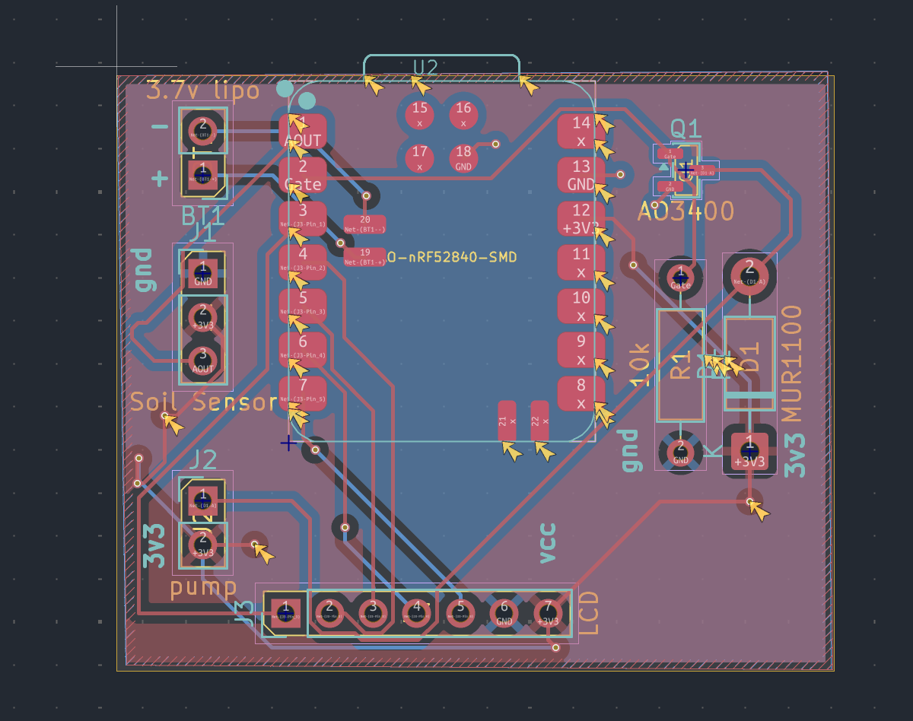
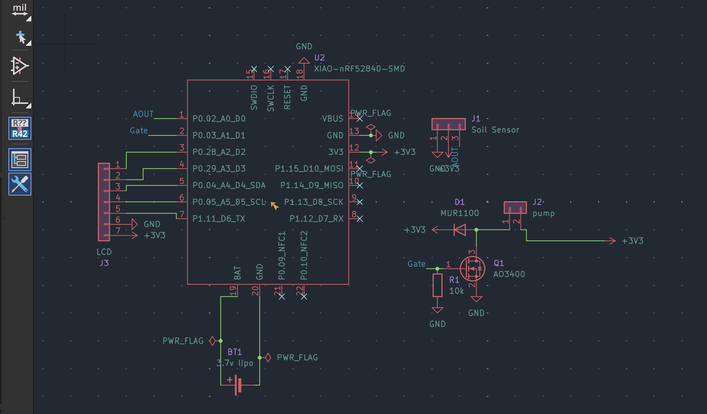
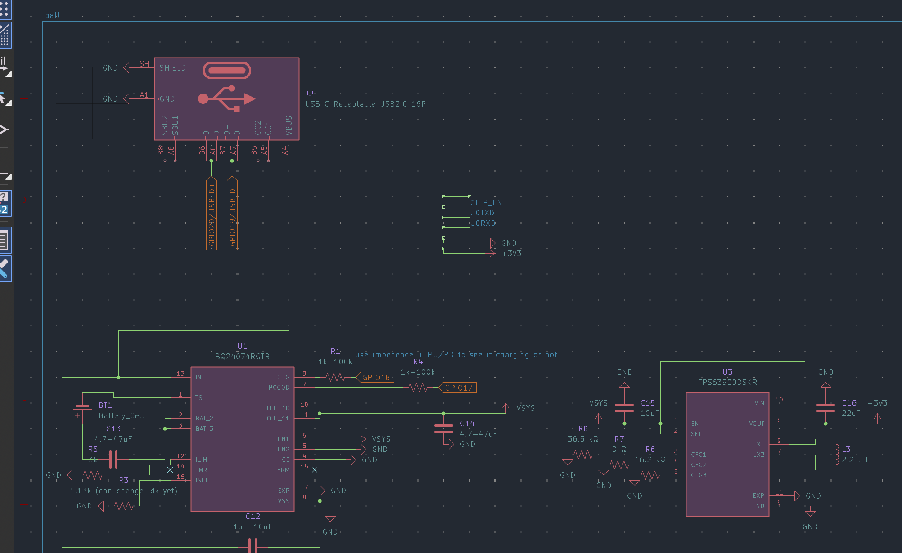
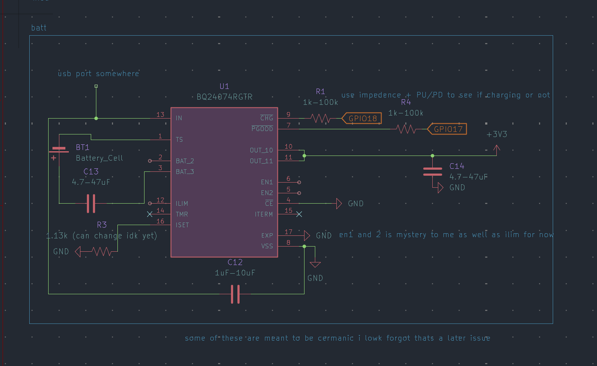
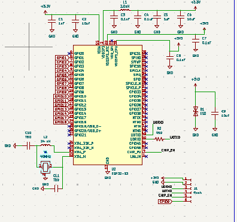
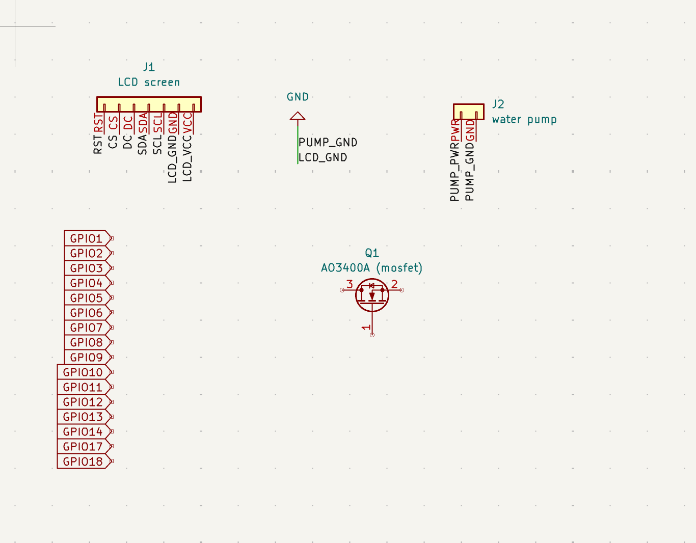
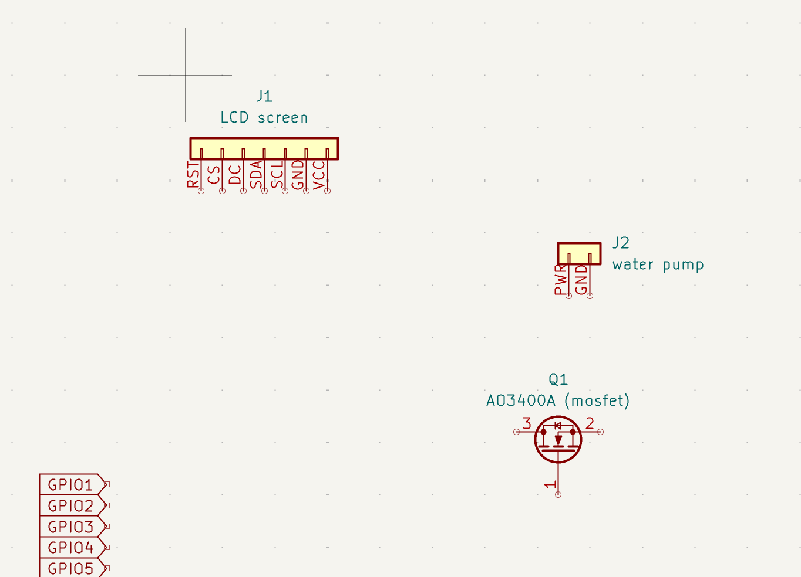
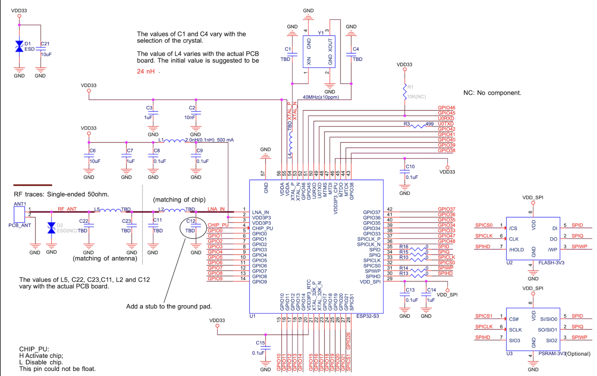
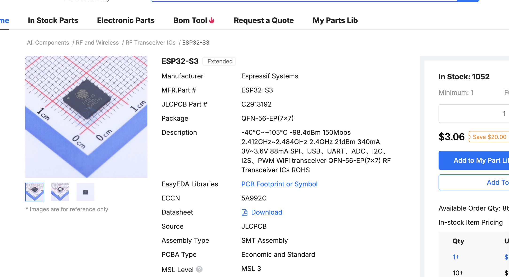
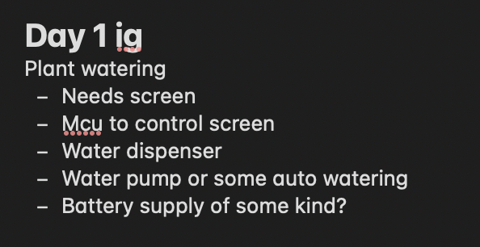

# July 15th: WE ARE SO BACK
so setting out on penguinpad i really wanted something I could have on the desk, and then decided i wanted to learn bare chip development. but then i lowk kinda did it in a devboard (based on a bunch of work from penguinplant) so ive pretty much restarted. old files are now stored in archive. anyways today i did some parts sourcing (because my aliexpress failed and then rewokred so i kidna did work i already did so ive deflated myself). parts list as follows:\
[a3400](https://www.aliexpress.us/item/3256811663962069.html?spm=a2g0o.productlist.main.4.145515e6lMcOW1&aem_p4p_detail=202607142330132166151538461680011572086&algo_pvid=f719a691-0879-4b7a-a0bd-b7d4a9868e07&algo_exp_id=f719a691-0879-4b7a-a0bd-b7d4a9868e07-3&pdp_ext_f=%7B%22order%22%3A%22154%22%2C%22eval%22%3A%221%22%2C%22fromPage%22%3A%22search%22%7D&pdp_npi=6%40dis%21USD%210.96%210.88%21%21%216.45%215.93%21%402101e5ab17840970130388503e129a%2112000056769123502%21sea%21US%217781105667%21ABX%211%210%21n_tag%3A-29910%3Bd%3A63cfb05%3Bm03_new_user%3A-29895&curPageLogUid=UTDxYzXkIbvH&utparam-url=scene%3Asearch%7Cquery_from%3A%7Cx_object_id%3A1005011850276821%7C_p_origin_prod%3A&search_p4p_id=202607142330132166151538461680011572086_1)\
[lcd](https://www.aliexpress.us/item/3256804295713253.html?spm=a2g0o.productlist.main.1.57fa40e7AM37Lp&algo_pvid=efa5b5ae-d43f-4a1b-8b82-3127da3e38ec&algo_exp_id=efa5b5ae-d43f-4a1b-8b82-3127da3e38ec-0&pdp_ext_f=%7B%22order%22%3A%226344%22%2C%22eval%22%3A%221%22%2C%22fromPage%22%3A%22search%22%7D&pdp_npi=6%40dis%21USD%213.04%210.99%21%21%213.04%210.99%21%402101062a17810066121352022e98c4%2112000049978631702%21sea%21US%210%21ABX%211%210%21n_tag%3A-29910%3Bd%3A5c316ac3%3Bm03_new_user%3A-29895%3BpisId%3A5000000207262906&curPageLogUid=VFN6cp8YSAkv&utparam-url=scene%3Asearch%7Cquery_from%3A%7Cx_object_id%3A1005004482028005%7C_p_origin_prod%3A#nav-description)\
[flyback diode](https://www.aliexpress.us/item/3256811738197733.html?spm=a2g0o.productlist.main.4.71c55bda2SP2el&aem_p4p_detail=202606090551042378211846771000000003063&algo_pvid=d5ca4f7c-56ad-4d61-b177-008e54dc4cc7&algo_exp_id=d5ca4f7c-56ad-4d61-b177-008e54dc4cc7-3&pdp_ext_f=%7B%22order%22%3A%2232%22%2C%22eval%22%3A%221%22%2C%22fromPage%22%3A%22search%22%7D&pdp_npi=6%40dis%21USD%211.97%210.99%21%21%2113.28%216.69%21%402140c1e917810094637746315e1637%2112000057033157395%21sea%21US%210%21ABX%211%210%21n_tag%3A-29910%3Bd%3A5c316ac3%3Bm03_new_user%3A-29895%3BpisId%3A5000000208023469&curPageLogUid=OemqhgArUy3t&utparam-url=scene%3Asearch%7Cquery_from%3A%7Cx_object_id%3A1005011924512485%7C_p_origin_prod%3A&search_p4p_id=202606090551042378211846771000000003063_1)\
[soil sensor](https://www.aliexpress.us/item/3256812092071273.html?spm=a2g0o.productlist.main.6.3dffc02cj65ZBS&algo_pvid=2079653a-8cbb-4a19-86ca-53557816e23e&algo_exp_id=2079653a-8cbb-4a19-86ca-53557816e23e-5&pdp_ext_f=%7B%22order%22%3A%223%22%2C%22eval%22%3A%221%22%2C%22fromPage%22%3A%22search%22%7D&pdp_npi=6%40dis%21USD%214.42%210.99%21%21%2129.77%216.66%21%402101e81117840954990793413e0ef4%2112000057959852045%21sea%21US%217781105667%21ABX%211%210%21n_tag%3A-29910%3Bd%3A63cfb05%3Bm03_new_user%3A-29895%3BpisId%3A5000000210792321&curPageLogUid=CtBhnZTP8G0m&utparam-url=scene%3Asearch%7Cquery_from%3A%7Cx_object_id%3A1005012278386025%7C_p_origin_prod%3A)\
[pump](https://www.aliexpress.us/item/3256809367623169.html?spm=a2g0o.productlist.main.1.7171flCLflCLFQ&algo_pvid=b8daa97c-eb63-43e9-b0b3-c885851a2e4c&algo_exp_id=b8daa97c-eb63-43e9-b0b3-c885851a2e4c-0&pdp_ext_f=%7B%22order%22%3A%22670%22%2C%22eval%22%3A%221%22%2C%22fromPage%22%3A%22search%22%7D&pdp_npi=6%40dis%21USD%211.26%210.99%21%21%218.51%216.69%21%40212a70c117810079816934664e84a7%2112000049447316452%21sea%21US%210%21ABX%211%210%21n_tag%3A-29910%3Bd%3A5c316ac3%3Bm03_new_user%3A-29895%3BpisId%3A5000000207262936&curPageLogUid=4J8hwvhzadAv&utparam-url=scene%3Asearch%7Cquery_from%3A%7Cx_object_id%3A1005009553937921%7C_p_origin_prod%3A&gatewayAdapt=glo2usa#nav-specificatio)

ill source esp32 s3 when i get closer to ordering it because aliexpress is really odd with pricing.
anywyas i did all the scheamtics and then did the PCB work today. Hardest part was mainly going through footprints, and I learned how a mosfet works (pretty cool stuff). also finally implemented a 3v3 plane + gnd plane for even less emi (not that it will really matter).

**Total time spent: 1 hours**

# July 6th:
so guess who has realized that uart is NOT flashign data ME ME ME ME EM. okay. i lied. it can be, but its not really necessary when you have D+ and D- (omg i cant wait to route this!! i heard orouting data lines for usb is REALLY fun!!) okay i also learned that gpio 9 is NOT the pin for strapping in s3 cus i got mixed up with c3!!! also also get this: i have NO clue how to wire chip en cus apparently i need to pull it high and low for button and then some capacitator stuff ill figure out later. anyways most of today was going back and reading datasheets i thought i was done with while consulting google. also i added the upload button! Time spent: 0.5 hours

**Total time spent: 0 hours**

# July 4th: (but later)
Worked on more batt work -- i wired up the TPS63900DSKR and started work on the usbc. i remebered i can just like use usbc for actual flashing instead of using a weird system to do it so time to figure out how data lines work!!! i cant wait!!!

wasnt super complicated after i learned what SEL was and how dual outputs work and then after reading some input tables it was pretty simple. Time spent: 0.75 hours

**Total time spent: 0 hours**

# July 4th: batt stuff
bro im so tired of battery work
i figured out how EN pins work -- turns out it assigns current or usb draw or usb500 or something todo with usb draw. anywyas i delt with that assigning it to usb2.0 standards. after that i had to figure out how im going to actually step it down, so i learned about buck boosts converters NOT step down bc boost is important. this whole thing is so overkill so TPS63900DSKR and another incredible ic from TI that im throwing in (i still need to add usb port). genuienly atp idk when ima finish battery power but its ok cus progress is progress. 

on the usb side it looks like ima do some stuff with ignoring HALF the usbc pins because most of them dont actaully matter and are for data delivery (which may be another project another time) so pretty much i have like 4 real pins to focus on and then something about fast charging. Time spent: 0.5 hours

**Total time spent: 0 hours**

# July 1st: WAKE UP ITS THE FIRST OF THE MONTH
RAHH BATTERY WIRING WE LOVE STAYING UP ON ABSURD TIMES TO WORK ON KICAD CUS JETLAG RAHHHHHH
anywyas i spent a lot of time today reading through documentaiton (ewwwww) of the BQ24074RGTR i will be using to control my battery + lipo. i got stuck on a few things and will deal with en1 and ilim another time. otherwise hopefully it will work !! i need to add usb port for it next (i have NO clue how usb works so i bet im in for a treat)
https://lapse.hackclub.com/timelapse/Dbl2Vt9vdpjg time spent: 0.5 hours

**Total time spent: 0 hours**

# June 29th: KICAD RAHHHHHH
GUESS WHO FINALLY GOT AROUND TO WIRING THINGS ME RAHHHHHHH. okay its like really late so lets go through what I did. The main things I did was do all of the mcu wiring (woah i didnt know i could do it). This took an really long time. why? cus im really dumb. took me a good few minutes to find the schematic, then took me time to reailze the example schematic and my schematic can differ.

Here are some key things i learned/did today:
1. was reminded that xtal32k isnt useful to me (i dont need exact precice timing)
2. was REALLY happy to learn i didn't have to wire LNA_in because im not doing wifi
3. figured out that all of the MT stuff is mainly for debugging (but because this will work first try i hopefully wont have to use for funny hardware debugging)
4. i learned what a decopuling capacitor is !! pretty much to my knowledge it just acts as a little backup, so things dont really go wrong (ie dropped voltage)
5. rx and tx are important for flashing data 
6. i have to use inductors. what is an inductor? i dont really know. something about filtering out noise 
7. crytsals somehow keep time. dont ask me how they just do. also there is a funny formula somewhere that the longer the traces are to the crystal teh change in capacitator needed!! 

Anyways I need to deal with battery management another time. quick thanks to [@JBlitzar](https://github.com/JBlitzar) bc i based my flashing mechanism off of his (did you know that gpio9 is now legacy or something and gpio0 is now boot for some c3 chips??) time spent: 1.5 hours

**Total time spent: 0 hours**

# June 19th: uh kicad work i guess
i added more gpio pins. im struggling to find where my 3.3v will come out on the pinout of the esp but welp that seems like a later issue. also did some quick wiring while looking at documentation (ima cry). I think i will focus on wiring up sensors first, and next priority is figuring out where 3v3 comes from. time spent: 0.25 hours

**Total time spent: 0 hours**

# June 14th: sensor work
i orginally thought i would need 90 degree joints and funny pcb design but i had the amazing realization that oh wait wires exist! so thats somekthing to remeber. another thing i should keep in mind is that my water should prob be in a different container than my electronics otherwise that could be kinda bad!

I will also be using stuff from JLC for pcba work:
- [esp32 s3](https://jlcpcb.com/partdetail/EspressifSystems-ESP32S3/C2913192)
- [AO3400A mosfet](https://jlcpcb.com/partdetail/Alpha_OmegaSemicon-AO3400A/C20917)
ill add flyback diodes later when i figure them out. guess who just learned global labels are different than regular after making a stupid amount of regular labels! time spent: 0.5 hours

**Total time spent: 0 hours**
# June 13th: understanding
cool! realizing the hole im digging myself into with qfn. anyways lets understand some parts today. (im procrastionating on reading data sheets).
1. sheets in kicad exist! press s to use them. apparently hierarical vs global labels vs power labels, but for my project i shall stick with global. 
2. things exist! heres some i will use while designing  a. [schematic checklist](https://docs.espressif.com/projects/esp-hardware-design-guidelines/en/latest/esp32s3/schematic-checklist.html)
  b. [datasheet](https://documentation.espressif.com/esp32-s3_datasheet_en.pdf)   c. [hardware design guidelines](https://docs.espressif.com/projects/esp-hardware-design-guidelines/en/latest/esp32s3/esp-hardware-design-guidelines-en-master-esp32s3.pdf)
3. crystal things exist! (i have only used xiao modudles and wroom dev modules so this is brand new to me). pretty much it needs to do funny timing stuff, so i need to make a "clock" with the xtal_p and xtal_n pins. the 32k ones are if i need precice timing during deep sleep (which i dont really). otherwise it turns out they can become gpio!
4. VDD is pretty much powering everything
5. PU chip is pull up. kinda important to keep EVERYTHING running. it apparently just makes the chip not turn on if its not pulled up. yikes!
5. strapping pins exist! its cool. it tells chippy what to do WHLIE booting. maybe avoid them! (and then also use them when i actaully need to)
6. there are a lot of vdds. also some do other things like rtc. idk why but hopefully i figure it out at some point
7. avoid gpio 19 and 20 cus they are part of usb pins
8. SPI pins importnat. idk what they do yet. it seems i will use them to flash stuff. i will look into this more later.
9. MT pins are debug dont really touch cus i dont need i can use as gpio ig uess
10. U0. maybe these are the real flashing pins. i dont know yet
11. gpio0 important i needd reset pin for flash (maybe)
12. adc 2 pins dont work with wifi (no clue why)
13. weak pulldown exists
time spent: 0.75 hours

**Total time spent: 0 hours**

# June 10th: parts
okayyy so i decided ima do fully SMD PCBA with the xiao s3 chip itself, rather than the xiao xiao! i wanted to do this because i feel like it will be a much harder challenge, and will be more fun (aka work), and allow me to grow as a builder a lot more. TIL that lcsc's parts library is NOT the same as JLCPCB's part library even tho they source from LCSC. welp i guess they source form other places too. also i will be switching to an s3 for performance.
time spent: 0.5 hours

**Total time spent: 0 hours**

# June 9th: Research & parts
goals:
Do parts research on what is needed

okay starting off with making an aliexpress acc to go buy parts (and look for them). genuienly bottom 5 site ive ever used. took me a while to get an acc (i deflated). anyways hope they r happy with my phone number. anyways for board type i think i will go with the xiao c3. i looked for a while on cheaper alternatives, but its minimal at best, and i think all in with the TP4056, and other work, it may just make more sense in general to go with the xiao c3. (also free shipping :D). genuienly looking for water pump took wAYY too long but lowk im a chud and couldnt find one. TIL what a mosfet is and i need to use one bc current draw exists. I also learned about a flyback diode, while I don't fully get it, it seems i may need one.

Parts List:\
[xiao c3](https://www.aliexpress.us/item/3256808605622611.html?spm=a2g0o.productlist.main.1.f86f1eaaJPPy2l&algo_pvid=88fe9a7b-8031-485e-a902-32c6e2d28adc&algo_exp_id=88fe9a7b-8031-485e-a902-32c6e2d28adc-0&pdp_ext_f=%7B%22order%22%3A%221094%22%2C%22eval%22%3A%221%22%2C%22fromPage%22%3A%22search%22%7D&pdp_npi=6%40dis%21USD%217.84%210.99%21%21%217.84%210.99%21%402140f54217810074411744749ec564%2112000052930246748%21sea%21US%210%21ABX%211%210%21n_tag%3A-29910%3Bd%3A5c316ac3%3Bm03_new_user%3A-29895%3BpisId%3A5000000207262921&curPageLogUid=44k5NjULlTpP&utparam-url=scene%3Asearch%7Cquery_from%3A%7Cx_object_id%3A1005008791937363%7C_p_origin_prod%3A)\
[lcd screen](https://www.aliexpress.us/item/3256804295713253.html?spm=a2g0o.productlist.main.1.57fa40e7AM37Lp&algo_pvid=efa5b5ae-d43f-4a1b-8b82-3127da3e38ec&algo_exp_id=efa5b5ae-d43f-4a1b-8b82-3127da3e38ec-0&pdp_ext_f=%7B%22order%22%3A%226344%22%2C%22eval%22%3A%221%22%2C%22fromPage%22%3A%22search%22%7D&pdp_npi=6%40dis%21USD%213.04%210.99%21%21%213.04%210.99%21%402101062a17810066121352022e98c4%2112000049978631702%21sea%21US%210%21ABX%211%210%21n_tag%3A-29910%3Bd%3A5c316ac3%3Bm03_new_user%3A-29895%3BpisId%3A5000000207262906&curPageLogUid=VFN6cp8YSAkv&utparam-url=scene%3Asearch%7Cquery_from%3A%7Cx_object_id%3A1005004482028005%7C_p_origin_prod%3A)\
[water pump](https://www.aliexpress.us/item/3256809367623169.html?spm=a2g0o.productlist.main.1.7171flCLflCLFQ&algo_pvid=b8daa97c-eb63-43e9-b0b3-c885851a2e4c&algo_exp_id=b8daa97c-eb63-43e9-b0b3-c885851a2e4c-0&pdp_ext_f=%7B%22order%22%3A%22670%22%2C%22eval%22%3A%221%22%2C%22fromPage%22%3A%22search%22%7D&pdp_npi=6%40dis%21USD%211.26%210.99%21%21%218.51%216.69%21%40212a70c117810079816934664e84a7%2112000049447316452%21sea%21US%210%21ABX%211%210%21n_tag%3A-29910%3Bd%3A5c316ac3%3Bm03_new_user%3A-29895%3BpisId%3A5000000207262936&curPageLogUid=4J8hwvhzadAv&utparam-url=scene%3Asearch%7Cquery_from%3A%7Cx_object_id%3A1005009553937921%7C_p_origin_prod%3A#nav-specification)\
[soil sensor](https://www.aliexpress.com/ssr/300000512/BundleDeals2?spm=a2g0o.productlist.main.3.3b1926c5PjpczG&productIds=1005008145000162%3A12000043981255787&pha_manifest=ssr&_immersiveMode=true&disableNav=YES&sourceName=SEARCHProduct&utparam-url=scene%3Asearch%7Cquery_from%3A%7Cx_object_id%3A1005008145000162%7C_p_origin_prod%3A1005007353966390&pvid=b94039c6-a6d0-402a-8512-eb841e5fab72&_gl=1*1s27d8z*_gcl_aw*R0NMLjE3ODEwMDYwMDEuRUFJYUlRb2JDaE1Jd3MzYW9vejZsQU1WTE5ZV0JSM0YzaHdWRUFBWUFTQUFFZ0pHel9EX0J3RQ..*_gcl_au*MTY0NzY3NDMyNC4xNzgxMDA2MDAw*_ga*OTU1ODEwOTY2MTM4MDk0LjE3ODEwMDU5Nzk0NzQ.*_ga_VED1YSGNC7*czE3ODEwMDYwMDAkbzEkZzEkdDE3ODEwMDgxNjAkajU1JGwwJGgw)\
[mosfet](https://www.aliexpress.us/item/3256810584186433.html?spm=a2g0o.productlist.main.8.67fb6c91kI6mpz&algo_pvid=5a4f3c1a-3229-45ac-887b-dc489313ddd2&algo_exp_id=5a4f3c1a-3229-45ac-887b-dc489313ddd2-20&pdp_ext_f=%7B%22order%22%3A%2214%22%2C%22eval%22%3A%221%22%2C%22fromPage%22%3A%22search%22%7D&pdp_npi=6%40dis%21USD%213.01%210.99%21%21%2120.31%216.71%21%40212e520f17810085948531669ee753%2112000053455106144%21sea%21US%210%21ABX%211%210%21n_tag%3A-29910%3Bd%3A5c316ac3%3Bm03_new_user%3A-29895%3BpisId%3A5000000207262936&curPageLogUid=YmupETK5ZUQj&utparam-url=scene%3Asearch%7Cquery_from%3A%7Cx_object_id%3A1005010770501185%7C_p_origin_prod%3A)\
[flyback diode](https://www.aliexpress.us/item/3256811738197733.html?spm=a2g0o.productlist.main.4.71c55bda2SP2el&aem_p4p_detail=202606090551042378211846771000000003063&algo_pvid=d5ca4f7c-56ad-4d61-b177-008e54dc4cc7&algo_exp_id=d5ca4f7c-56ad-4d61-b177-008e54dc4cc7-3&pdp_ext_f=%7B%22order%22%3A%2232%22%2C%22eval%22%3A%221%22%2C%22fromPage%22%3A%22search%22%7D&pdp_npi=6%40dis%21USD%211.97%210.99%21%21%2113.28%216.69%21%402140c1e917810094637746315e1637%2112000057033157395%21sea%21US%210%21ABX%211%210%21n_tag%3A-29910%3Bd%3A5c316ac3%3Bm03_new_user%3A-29895%3BpisId%3A5000000208023469&curPageLogUid=OemqhgArUy3t&utparam-url=scene%3Asearch%7Cquery_from%3A%7Cx_object_id%3A1005011924512485%7C_p_origin_prod%3A&search_p4p_id=202606090551042378211846771000000003063_1)\
[lipo](https://www.aliexpress.us/item/3256805052966980.html?spm=a2g0o.productlist.main.13.24106915kLa9Rz&algo_pvid=9ab030b7-6c68-49e5-b052-152487eaed1d&algo_exp_id=9ab030b7-6c68-49e5-b052-152487eaed1d-12&pdp_ext_f=%7B%22order%22%3A%2217%22%2C%22eval%22%3A%221%22%2C%22fromPage%22%3A%22search%22%7D&pdp_npi=6%40dis%21USD%2113.79%210.99%21%21%2113.79%210.99%21%4021015b7d17810096105385958e4a40%2112000037114559271%21sea%21US%210%21ABX%211%210%21n_tag%3A-29910%3Bd%3A5c316ac3%3Bm03_new_user%3A-29895%3BpisId%3A5000000208023469&curPageLogUid=yFJHec5QbFGz&utparam-url=scene%3Asearch%7Cquery_from%3A%7Cx_object_id%3A1005005239281732%7C_p_origin_prod%3A)

next steps:
pcb design!
time spent: 1 hour

**Total time spent: 0 hours**